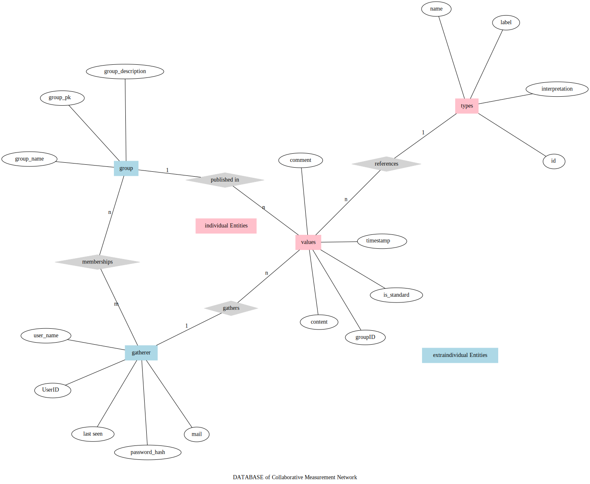
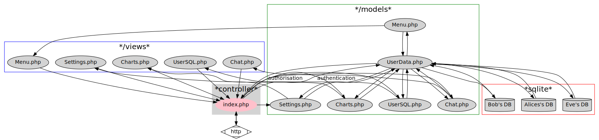

# colamator
Collaborative Measurement Network

## Ziele

* Eine (Traininigs-) Gruppe erhebt gemeinsam Daten und postet die in einem fortlaufenden Chat
* Beispiele: 
  * Anzahl Wiederholungen von Übungen
  * Körpergewicht
  * Kalorien
  * Trinkmenge
* Die Werte haben immer einen Datentyp und werden auch so strukturiert verarbeitet
* Ein Standard-Datentyp ist "Bullshit" - ein anderer Datentyp ist "Foo"
* Teilnehmer*innen können entscheiden, wie öffentlich sie ihre Werte posten
* Es gibt private Auswertungen (Grafiken)
* Es gibt Auswertungen über die Gruppe
* Es können Ziele definiert werden
* Wichtig sind Notifikationen an das Smartphone (WebApp?)
* Andere Szenarien:
  * Eine Schulklasse misst Temperaturen, Sonnenuntergang, die Zeit zum Zähneputzen
  * Ein Physikkurs erhebt Zeitmessungen an einem Fadenpendel
  * Ein Bot registriert das Erscheinen von Personen
  * Bei einer Veranstaltung (z.B. HackN8) wird die Menge an Süßigkeiten gemessen
  * Eine Kontrollgruppe erhebt die Zeit, die man für Hausuafgaben benötigt
* Es muss einen Datenexport geben in:
  * JSON
  * CSV

## Architektur

* möglichst dezentral
* für alle Skills Beteiligung möglich
* diverse Datenbanken
  * SQLITE
  * Je Benutzer eine (Idee: Eigene Datenanfragen möglich)
  * Für Collaboration/Chat eine
  * Merging?
  
## ERM
 

# MVC-Adaption

## API Endpoints

### POST

#### /api/users/datatypes

Liefert Datentypen, die für einen Benutzer festegelegt sind

body: {"username":"maxmustermann"}
response: {...}

#### /api/users/

erzeugt einen neuen user

body: {"password":"strenggeheim", "username":"maxmustermann"}
response: {...}

#### /api/users/login

loggt einen benutzer ein

body: {"password":"strenggeheim", "username":"maxmustermann"}
response: {...}

#### /api/users/add_device_key

hinterlegt pro benutzer einen device-key für push-notifikationen

body: {"username":"maxmustermann","device_key":"sdfg","device_name":"my "}
response: {...}

### GET
